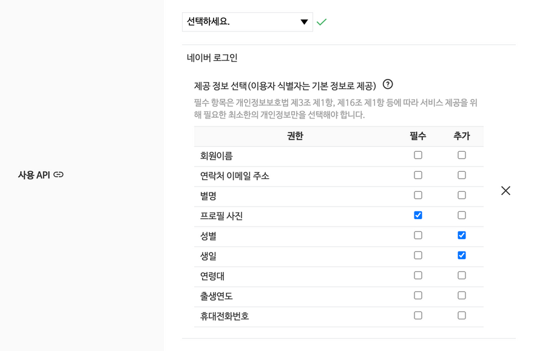

# 사전 준비 사항

네이버 오픈API를 사용하려면 먼저 [네이버 개발자 센터](https://developers.naver.com/)에서 애플리케이션을 등록하고 클라이언트 아이디와 클라이언트 시크릿을 발급받아야 합니다.

클라이언트 아이디와 클라이언트 시크릿은 인증된 사용자인지를 확인하는 수단이며, 애플리케이션이 등록되면 발급됩니다. 클라이언트 아이디와 클라이언트 시크릿을 네이버 오픈API를 호출할 때 HTTP 헤더에 포함해서 전송해야 API를 호출할 수 있습니다. API 사용량은 클라이언트 아이디별로 합산됩니다.

> **주의**  
> 네이버에 로그인한 사용자 계정으로 애플리케이션이 등록됩니다. 애플리케이션을 등록한 네이버 아이디는 '관리자' 권한을 가지게 되므로 네이버 계정의 보안에 각별히 주의해야 합니다.  
> 회사나 단체에서 애플리케이션을 등록할 때는 추후 키 관리 등이 용이하도록 네이버 단체 회원으로 로그인해 이용할 것을 권장합니다.
> - [네이버 단체 회원 가입하기](https://nid.naver.com/group/commonAction.nhn?m=viewTerms)

## 애플리케이션 등록

네이버 개발자 센터에서 애플리케이션을 등록하는 방법은 다음과 같습니다.

1. 네이버 개발자 센터의 메뉴에서 <strong>[Application &gt; 애플리케이션 등록](https://developers.naver.com/apps/#/wizard/register)</strong>을 선택합니다.  
2. **이용약관 동의** 단계에서 <strong>이용약관에 동의합니다.</strong>를 선택한 다음 **확인**을 클릭합니다.  
3. **계정 정보 등록** 단계에서 휴대폰 인증을 완료하고 회사 이름을 입력한 다음 **확인**을 클릭합니다. 휴대폰 인증은 담당자 연락처 확인을 위해 필요한 과정이며, 애플리케이션을 처음 등록할 때 한 번만 인증받으면 됩니다.  
4. **애플리케이션 등록 (API이용신청)** 페이지에서 [애플리케이션 등록 세부 정보](#애플리케이션-등록-세부-정보)를 입력한 다음 **등록하기**를 클릭합니다.  

## 애플리케이션 등록 세부 정보

**애플리케이션 등록 (API이용신청)** 페이지에서 애플리케이션 세부 정보를 입력하는 방법은 다음과 같습니다.
 

1. 등록하려는 애플리케이션의 이름을 **애플리케이션 이름**에 입력합니다.
2. **사용 API**에서 애플리케이션에 사용할 네이버 오픈API를 선택해 추가합니다. API는 여러 개를 추가할 수 있습니다.
3. **로그인 오픈 API 서비스 환경**과 **비로그인 오픈 API 서비스 환경**에서 애플리케이션을 서비스할 환경을 추가하고 필요한 상세 정보를 입력합니다. **로그인 오픈 API 서비스 환경**은 **사용 API**에서 [로그인 방식 오픈 API](apilist.md#로그인-방식-오픈-api)에 해당하는 API를 선택하면 나타납니다. **비로그인 오픈 API 서비스 환경**은 **사용 API**에서 [비로그인 방식 오픈 API](apilist.md#비로그인-방식-오픈-api)에 해당하는 API를 선택하면 나타납니다.

### 애플리케이션 이름

등록할 애플리케이션의 이름을 **애플리케이션 이름**에 입력합니다. 애플리케이션 이름은 최대 40자까지 입력할 수 있습니다.

로그인 방식 오픈 API를 사용할 때는 다음 화면처럼 네이버 로그인 화면에 애플리케이션 이름이 표시되므로 10자 이내의 간결한 이름을 사용하는 것을 권장합니다.
 

### 사용 API

애플리케이션에 사용할 네이버 오픈API를 **사용 API**에서 선택해 추가합니다. 여러 개를 추가할 수 있으며, **X**를 클릭하면 API를 목록에서 삭제할 수 있습니다.
 

> **네이버 로그인**  
> 로그인 방식 오픈 API에 해당하는 API인 카페, 캘린더를 선택해 추가하면 **네이버 로그인**<!-- -->이 자동으로 추가됩니다.

### 로그인 오픈 API 서비스 환경

로그인 방식 오픈 API 사용에 필요한 서비스 환경별 상세 정보는 **로그인 오픈 API 서비스 환경**에서 입력합니다.

**환경 추가**에서 애플리케이션을 서비스할 환경을 클릭해 서비스 환경을 추가합니다. 여러 개를 추가할 수 있으며, **X**를 클릭하면 서비스 환경을 목록에서 삭제할 수 있습니다.
 

서비스 환경에 따라 입력해야 하는 정보는 다음과 같습니다.

#### 안드로이드

- 다운로드 URL: 애플리케이션을 다운로드할 수 있는 Google Play의 URL을 입력합니다. 애플리케이션이 Google Play에 등록되지 않은 상태라면 임의의 URL(예: 개발사 홈페이지 URL)을 입력하고 애플리케이션이 등록된 이후에 변경하십시오.
- 안드로이드 앱 패키지 이름: Android 애플리케이션의 패키지 이름을 입력합니다. 등록된 패키지 이름과 로그인을 시도하는 Android 애플리케이션의 패키지 이름이 다르면 인증에 실패할 수 있습니다.

#### iOS

- 다운로드 URL: 애플리케이션을 다운로드할 수 있는 App Store의 URL을 입력합니다. 애플리케이션이 App Store에 등록되지 않은 상태라면 임의의 URL(예: 개발사 홈페이지 URL)을 입력하고 애플리케이션이 등록된 이후에 변경하십시오.
- URL Scheme: 네이버 앱에서 수행한 로그인 인증 결과를 전달받을 URL Scheme을 입력합니다.

#### Mobile 웹

- 서비스 URL: 모바일 환경에서 웹 서비스에 접속할 URL을 입력합니다. 포트 번호와 프로토콜은 구분하지 않으므로 도메인 이름만 주의해서 입력하세요. `www`를 제외한 도메인을 입력하면 서브 도메인을 따로 입력할 필요가 없습니다. 예를 들어 `naver.com`을 입력하면 `map.naver.com`와 `dev.naver.com` 같은 서브도메인은 입력할 필요가 없습니다.
- 네이버 로그인 Callback URL: 모바일 환경에서 네이버 로그인 인증이 완료되면 인증 성공 여부, 인증 코드 등을 반환할 콜백 URL을 입력합니다. 최대 5개까지 추가할 수 있습니다.

#### PC 웹

- 서비스 URL: 웹 서비스에 접속할 URL을 입력합니다. 포트 번호와 프로토콜은 구분하지 않으므로 도메인 이름만 주의해서 입력하세요. `www`를 제외한 도메인을 입력하면 서브 도메인을 따로 입력할 필요가 없습니다. 예를 들어 `naver.com`을 입력하면 `map.naver.com`와 `dev.naver.com` 같은 서브도메인은 입력할 필요가 없습니다
- 네이버 로그인 Callback URL: 네이버 로그인 인증이 완료되면 인증 성공 여부, 인증 코드 등을 반환할 콜백 URL을 입력합니다. 최대 5개까지 추가할 수 있습니다.

#### Windows App

- 다운로드 URL: 애플리케이션을 다운로드할 수 있는 URL을 입력합니다.
- Callback URL: 네이버 로그인 인증이 완료되면 인증 성공 여부, 인증 코드 등을 반환할 콜백 URL을 입력합니다.

### 비로그인 오픈 API 서비스 환경

비로그인 방식 오픈 API 사용에 필요한 서비스 환경별 상세 정보는 **비로그인 오픈 API 서비스 환경**에서 입력합니다.

**환경 추가**에서 애플리케이션을 서비스할 환경을 클릭해 서비스 환경을 추가합니다. 여러 개를 추가할 수 있으며, **X**를 클릭하면 서비스 환경을 목록에서 삭제할 수 있습니다.
 

서비스 환경에 따라 입력해야 하는 정보는 다음과 같습니다.

#### Android 설정

- 안드로이드 앱 패키지 이름: Android 애플리케이션의 패키지 이름을 입력합니다.

#### iOS 설정

- iOS Bundle ID: iOS 애플리케이션의 번들 아이디를 입력합니다.

#### WEB 설정

- 웹 서비스 URL: 웹 서비스에 접속할 URL을 입력합니다. 최대 10개까지 추가할 수 있습니다. 포트 번호와 프로토콜은 구분하지 않으므로 도메인 이름만 주의해서 입력하세요. `www`를 제외한 도메인을 입력하면 서브 도메인을 따로 입력할 필요가 없습니다. 예를 들어 `naver.com`을 입력하면 `map.naver.com`와 `dev.naver.com` 같은 서브도메인은 입력할 필요가 없습니다.

## 애플리케이션 등록 확인

애플리케이션이 정상적으로 등록되면 네이버 개발자 센터의 **[Application &gt; 내 애플리케이션](https://developers.naver.com/apps/#/list)** 메뉴의 아래에 등록한 애플리케이션 이름으로 하위 메뉴가 생깁니다.

애플리케이션 이름을 클릭하면 **개요** 탭에서 애플리케이션에 부여된 클라이언트 아이디와 클라이언트 시크릿을 확인할 수 있습니다.
 

## 클라이언트 아이디와 클라이언트 시크릿 확인

네이버 API를 호출할 때 클라이언트 아이디와 클라이언트 시크릿 값을 HTTP 헤더에 포함해서 전송해야 API를 호출할 수 있습니다.

클라이언트 시크릿 값은 클라이언트 아이디의 비밀번호와 같은 성격의 값입니다. 클라이언트 시크릿 값을 보려면 **Client Secret**에서 **보기**를 클릭합니다. **보기**를 클릭하면 버튼이 **재발급**으로 바뀝니다. **재발급**을 클릭하면 새로운 클라이언트 시크릿을 발급받을 수 있습니다.
 

